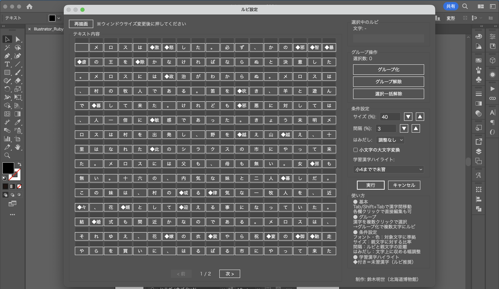
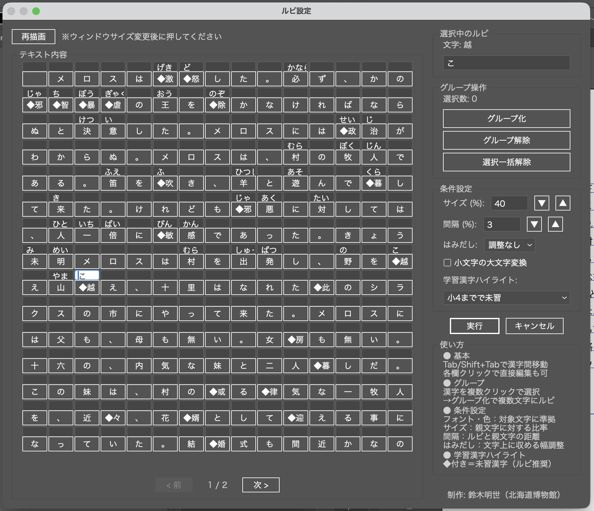
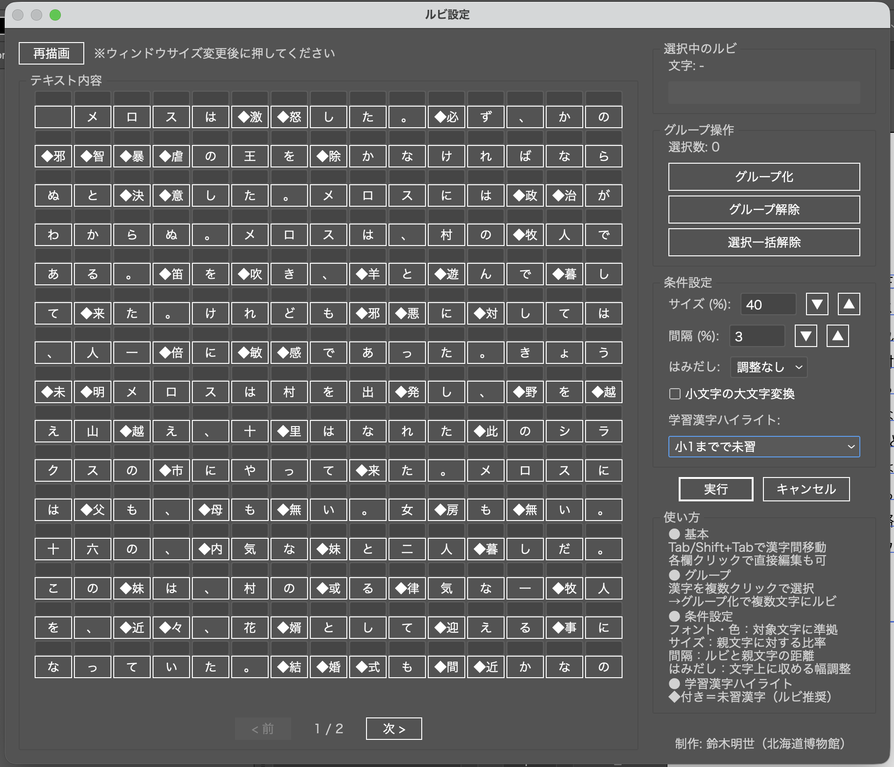
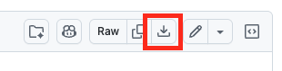
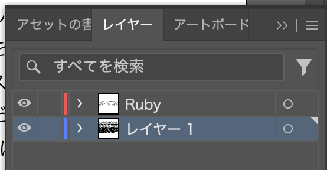

# Illustrator Ruby GUI　（ver.1.0 2026/04/05公開）

Adobe Illustrator上で、選択したテキストにルビ（ふりがな）をGUIで設定・配置するスクリプトです。
イラレでのルビ振りという苦行から、少しでも解放できればと思い公開します。

## 特徴

- **直感的なGUI**: 文字一覧を見ながらスムーズにルビを入力できます。実行後、ルビごとのテキストボックスが配置されます。
- **漢字のグループ化対応**: 複数の漢字に一つのルビ（熟語ルビなど）を振ることが可能です。
- **自動書式取得**: ルビのフォントや色は、対象の文字から自動的に取得されます。
- **書式調整機能**: ルビの文字サイズや親文字からの間隔等は、自由に調整できます。
- **縦書き・横書き両対応**: テキストの方向に合わせて適切に配置します。
- **学年別漢字マークアップ**: 小学校の各学年で未習の漢字をハイライト表示できます。

## スクリーンショット

### スクリプト起動時の画面


### ルビ入力中の様子（Tab/shift+Tabで前後の「漢字」に遷移）


### 学習漢字ハイライトを小1に変更した場合


### ルビ配置の前後比較

**実行前**


**実行後**


## インストール方法

1. `Illustrator Ruby GUI.jsx` をダウンロードします。
   - ページ上部の[Illustrator Ruby GUI.jsx](https://github.com/akiyo-as/illustrator_ruby_GUI/blob/main/Illustrator%20Ruby%20GUI.jsx)をクリック。
   - 右側にあるアイコンの並びから、以下のアイコンをクリックするとダウンロード可能です。


2. Illustratorのスクリプトフォルダに移動します。
   - **macOS**: `/Applications/Adobe Illustrator [Version]/Presets/[Language]/Scripts`
   - **Windows**: `C:\Program Files\Adobe\Adobe Illustrator [Version]\Presets\[Language]\Scripts`
3. Illustratorを再起動して実行（「ファイル」>「スクリプト」>Illustrator Ruby GUI.jsx）してください。
* 任意のフォルダに保存し、「ファイル」>「スクリプト」>「その他のスクリプト」>該当フォルダ>Illustrator Ruby GUI.jsx で実行することも可能です。

## 使い方

1. Illustrator上で対象のテキストフレームを選択します。
2. スクリプトを実行します。
3. GUIが表示されるので、各文字の下にある入力欄にルビを入力します。
   - `Tab` キーで次の漢字へ移動できます（`Shift+Tab` で前の漢字に戻る）。
   - 複数の文字を選択して「グループ化」することで、まとめてルビを振れます。
4. 「実行」ボタンを押すと、ルビが配置されます。

配置されたルビは「Ruby」という名前のレイヤーが自動作成され、その中にテキストフレームごとのグループとしてまとめられます。



### 条件設定

GUIの右サイドバーで以下の項目を設定できます。

| 項目 | 説明 |
|---|---|
| **サイズ (%)** | ルビの文字サイズを親文字に対する比率で指定します。▲▼ボタンで5%刻みの調整も可能です。（デフォルト: 40%） |
| **間隔 (%)** | ルビと親文字の間の距離を親文字サイズに対する比率で指定します。▲▼ボタンで1%刻みの調整も可能です。（デフォルト: 3%） |
| **はみだし** | ルビが親文字より長い場合の処理方法を選択します。「調整なし」はそのままはみ出し、「変形」はルビを縮小して親文字の幅に収めます。 |
| **小文字の大文字変換** | チェックすると、ルビ内の小書き仮名（ぁ→あ、っ→つ、ャ→ヤ等）を通常の大きさの仮名に変換して配置します。 |
| **学習漢字ハイライト** | 小学校の学年を選択すると、その学年までに習わない漢字を◆マークで強調表示します。ルビを振るべき漢字の目安になります。（2020年度からの新学習指導要領に従っています） |

- ルビのフォントと色は、対象の親文字から自動的に取得されます（個別設定は不要です）。

### ページ送り

テキストが長い場合、画面に収まる分だけが1ページとして表示されます。
パネル下部の「< 前」「次 >」ボタンでページを切り替えてください。

- 入力済みのルビはページを切り替えても保持されます。
- `Tab` / `Shift+Tab` でページ末尾・先頭に達すると、自動的に次・前のページへ移動します。

### 再描画

ウィンドウサイズを手動で変更した場合、レイアウトは自動更新されません。
左上の「再描画」ボタンを押すと、現在のウィンドウサイズに合わせてレイアウトが再計算されます。

- 入力済みのルビデータや表示中のページは保持されます。
- ウィンドウを広げれば1行あたりの文字数が増え、狭めれば減ります。

## デフォルト値の変更方法

スクリプトファイル（`Illustrator Ruby GUI.jsx`）をテキストエディタで開き、以下の行の数値を変更することでデフォルト値をカスタマイズできます。

### ルビサイズのデフォルト値

382行目の `"40"` を変更します（親文字に対する比率 %）。

```javascript
// サイズ
var sizeGroup = settingsPanel.add("group");
sizeGroup.add("statictext", undefined, "\u30B5\u30A4\u30BA (%):");
var sizeInput = sizeGroup.add("edittext", undefined, "40");  // ← この数値を変更
```

例: デフォルトを50%にする場合 → `"40"` を `"50"` に変更

### ルビ間隔のデフォルト値

394行目の `"3"` を変更します（親文字サイズに対する比率 %）。

```javascript
// 間隔
var gapGroup = settingsPanel.add("group");
gapGroup.add("statictext", undefined, "\u9593\u9694 (%):");
var gapInput = gapGroup.add("edittext", undefined, "3");  // ← この数値を変更
```

例: デフォルトを5%にする場合 → `"3"` を `"5"` に変更

### 学習漢字ハイライトのデフォルト学年

167行目の末尾の数値を変更します（0=なし、1=小1、2=小2、...、6=小6）。

```javascript
// 学習漢字ハイライト設定（0=なし、1〜6=その学年まで既習とみなす、デフォルト4）
var kanjiHighlightGrade = (options && options.kanjiHighlightGrade !== undefined) ? options.kanjiHighlightGrade : 4;  // ← 末尾の数値を変更
```

例: デフォルトを小3までで未習にする場合 → 末尾の `4` を `3` に変更

## 注意事項

- 単一のテキストフレームのみを対象としています。
- ルビの配置には `createOutline()` を使用しているため、実行後に微調整が必要な場合があります。
- ルビは各文字の中心に配置されます。字形によっては見た目の美しさのために微調整が必要な場合があります。
- スクリプトの実行前に必ず保存してください。フリーズが生じた際の責任は負いかねます。

## ライセンス

このプロジェクトは MIT License の下で公開されています。

- **Original work**: Copyright (c) 2022 いなにわうどん ([illustrator-ruby](https://github.com/inaniwaudon/illustrator-ruby))
- **Modifications**: Copyright (c) 2026 鈴木明世（北海道博物館）
